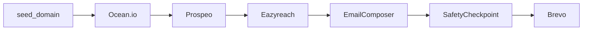

# Automated Outreach Pipeline

End-to-end CLI pipeline for Vocallabs SDE assignment:

**Ocean.io** (lookalikes) → **Prospeo** (decision-makers) → **Eazyreach** (emails) → **Brevo** (send)

## Quick start

```bash
cd outreach-app
python -m venv .venv
.venv\Scripts\activate        # Windows
pip install -e .

# Test without API keys
python -m outreach stripe.com --mock --dry-run --confirm-send
```

## Live run (after account setup)

1. Copy `.env.example` → `.env` and fill API keys
2. Verify Brevo sender email/domain
3. Run with a small limit first:

```bash
python -m outreach your-seed.com --max-companies 10 --dry-run
python -m outreach your-seed.com --max-companies 10 --confirm-send
```

## CLI flags

| Flag | Description |
|------|-------------|
| `--mock` | Use fixture data (no API calls for stages 1–3) |
| `--dry-run` | Skip real Brevo send |
| `--confirm-send` | Auto-confirm after checkpoint (non-interactive) |
| `--max-companies N` | Cap lookalike companies (default 25) |
| `--max-contacts-per-company N` | Cap Prospeo contacts per domain |
| `--use-llm` | Personalize emails via OpenAI API |
| `--save-run` | Write `runs/run_<timestamp>.json` |
| `-v` | Verbose logging |

## Project structure

```
src/outreach/
  cli.py                 # Typer entrypoint
  config.py              # .env settings
  clients/               # HTTP/SDK wrappers per vendor
  stages/                # One stage per pipeline step
  pipeline/              # Orchestrator + checkpoint
  services/              # Dedupe, retries, email composer
  mocks/                 # Fixtures for offline dev
```

## Architecture



## Safety checkpoint

Before any email is sent, the CLI prints a table of recipients (company, name, title, email, subject). You must confirm interactively (`y`) or pass `--confirm-send`.

## Resilience

- **Rate limits:** `tenacity` retries on 429/5xx with exponential backoff
- **Eazyreach async:** polls on HTTP 202
- **Missing data:** skips contacts without LinkedIn/email; run continues
- **Dedup:** by LinkedIn URL (Prospeo) and email (Eazyreach)

## Eazyreach API note

The Eazyreach client uses a placeholder endpoint (`/v1/enrich/linkedin-email`). After signup, update `LINKEDIN_TO_EMAIL_PATH` and request body in `clients/eazyreach_client.py` to match their dashboard docs.

## Interview talking points

1. **Modularity:** each stage is isolated; orchestrator wires them
2. **Mock mode:** demo code walkthrough without burning credits
3. **Checkpoint:** deliberate safety before irreversible send
4. **Partial failure:** stages return errors + partial data, not crash
5. **LLM optional:** template fallback if API key missing or LLM fails

## Account setup order

1. Domain → company email
2. Ocean.io (needs company email)
3. Prospeo, Eazyreach, Brevo
4. Request Eazyreach credit top-up via assignment WhatsApp
